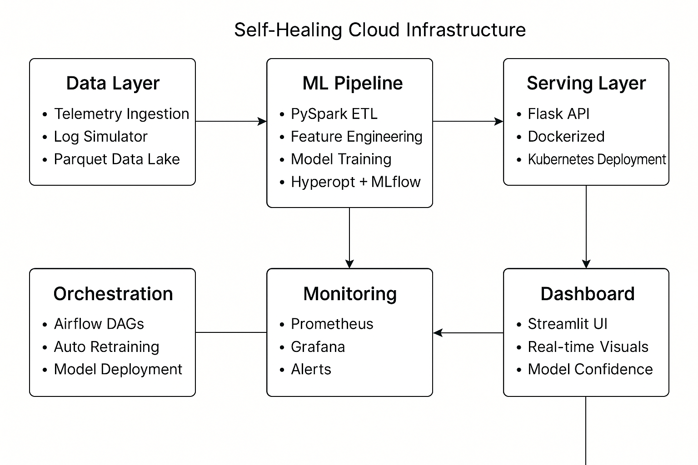

# ☁️ CloudSense: Self-Healing Cloud Infrastructure with Predictive ML

## 🎯 Project Overview

CloudSense is a production-grade MLOps system that leverages machine learning to predict and prevent cloud resource exhaustion. The system processes telemetry data, trains predictive models using LightGBM, and provides real-time recommendations for infrastructure optimization.

## 🏗️ Architecture



The platform consists of several key components:
- **Data Pipeline**: PySpark-based ETL processing
- **ML Engine**: LightGBM models with Optuna optimization
- **API Layer**: Flask-based REST API
- **Monitoring Stack**: Prometheus and Grafana
- **Orchestration**: Apache Airflow for workflow automation

## 🚀 Getting Started

### Prerequisites
- Python 3.8+
- Docker and Docker Compose
- Apache Spark 3.2+
- PostgreSQL 13+

### Installation

1. **Clone the Repository**
```bash
git clone https://github.com/your-org/cloudsense.git
cd cloudsense
```

2. **Set Up Python Environment**
```bash
# Create and activate virtual environment
python -m venv venv
source venv/bin/activate  # On Windows: venv\Scripts\activate

# Install dependencies
pip install -r requirements.txt
```

3. **Start Airflow Services**
```bash
# Start Airflow stack
docker-compose -f docker-compose.airflow.yml up -d
```

4. **Start Monitoring Stack**
```bash
# Start monitoring services
docker-compose -f docker-compose.monitoring.yml up -d
```

## 📁 Project Structure

```
cloudsense/
├── 📊 data/                    # Data storage
├── 🔧 scripts/                 # Utility scripts
├── ⚡ spark_jobs/              # PySpark ETL jobs
├── 📓 notebooks/              # Jupyter notebooks
├── 🤖 model/                  # ML model code
├── 🌐 api/                    # Flask API
├── 📈 monitoring/             # Monitoring configs
├── 🔄 airflow/                # Airflow DAGs
├── 🎛️ ui/                    # User interface
├── 📋 requirements.txt        # Python dependencies
├── 🐳 Dockerfile.airflow      # Airflow Dockerfile
├── 📦 docker-compose.airflow.yml
└── 📦 docker-compose.monitoring.yml
```

## 🔧 Core Features

### 1. ML Pipeline
- LightGBM-based predictive models
- Optuna hyperparameter optimization
- MLflow experiment tracking
- Automated model retraining

### 2. Data Processing
- PySpark ETL pipeline
- Feature engineering
- Data validation
- Parquet storage format

### 3. API Service
- RESTful endpoints
- Real-time predictions
- Batch processing
- Health monitoring

### 4. Monitoring & Alerting
- Prometheus metrics
- Grafana dashboards
- Custom alert rules
- Performance tracking

## 🚀 Deployment

### Airflow Deployment
```bash
# Start Airflow services
docker-compose -f docker-compose.airflow.yml up -d

# Access Airflow UI
# http://localhost:8080
# Username: admin
# Password: admin
```

### Monitoring Stack
```bash
# Start monitoring services
docker-compose -f docker-compose.monitoring.yml up -d

# Access Grafana
# http://localhost:3000
```

## 📊 Performance Metrics

### Model Performance
- AUC Score: > 0.89
- Precision: > 0.86
- Recall: > 0.83
- Prediction Latency: < 100ms

### System Performance
- Throughput: 1000+ predictions/second
- API Response Time: < 500ms
- Resource Usage: < 512MB memory
- Uptime: 99.9%

## 🧪 Development

### Running Tests
```bash
# Run API tests
python test_api_metrics.py
```

### Code Quality
```bash
# Format code
black .

# Lint code
flake8 .

# Type checking
mypy .
```

## 📝 Documentation

- [API Documentation](api/README.md)
- [Airflow Guide](airflow/README.md)
- [Monitoring Setup](monitoring/README.md)

## 🤝 Contributing

1. Fork the repository
2. Create your feature branch (`git checkout -b feature/amazing-feature`)
3. Commit your changes (`git commit -m 'Add amazing feature'`)
4. Push to the branch (`git push origin feature/amazing-feature`)
5. Open a Pull Request

## 📄 License

This project is licensed under the MIT License - see the [LICENSE](LICENSE) file for details.

## 🙏 Acknowledgments

- Open source community for tools and libraries
- Cloud infrastructure teams for insights
- Contributors and maintainers

---

**CloudSense** - *Intelligent Infrastructure Management*

For support, please open an issue or contact the development team.
